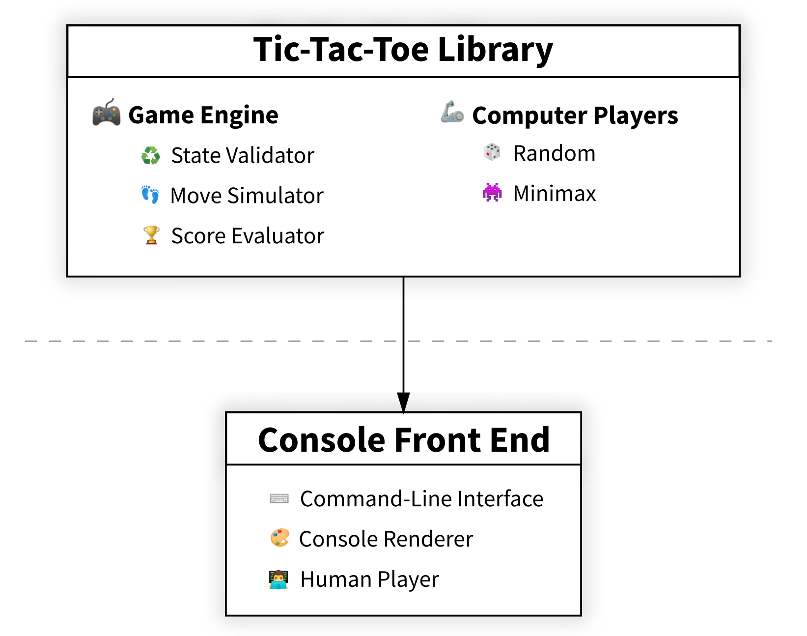

# Tic-Tac-Toe with AI Player


## Motivation

Throughout a year of my Pythonist journey I was mostly doing web programming and I really wanted to try something unfamiliar.
Since my childhood I was into games and I just could not help myself but pry into the programming wonders of it.
I really liked feeling of logic complexity that this project gave, even though I strongly suspect that it is just a tip of an enormous iceberg :).

This work was completed thanks to [Real Python](https://realpython.com/), a website with the hands-on and beautiful Python tutorials.
Please follow the link to find the materials:
[Build a Tic-Tac-Toe Game Engine With an AI Player in Python](https://realpython.com/tic-tac-toe-ai-python/). 


## Overview

Tic-Tac-Toe Game Engine consists of two high-level components depicted in the diagram below:



The first component contains core logic of the game and two artificial players and is agnostic about the way the game is presented to the user.

Visual part is a higher-level text-based console front end and treats game library as a runnable Python package that is invoked from the command line using Python's -m option.

The project has a precise, step-by-step implementation structure which can be decomposed into the following parts:

* Create a reusable Python library with the tic-tac-toe game engine
* Model the domain of tic-tac-toe including gamestate validation layer
* Implement game loop and player classes one of which is an unbeatable AI player based on the minimax algorithm
* Build a text-based console front end for the game with a human player

The project was built using Python 3.9 with focus on modern Python code practices and patterns such as:

* Object-oriented programming (OOP)
* Inheritance and composition
* Abstract classes
* Data classes
* Type hints
* Regular expressions
* Caching
* Recurcion


## How to run the game

First of all, create and activate a shared virtual environment in tic_tac_toe_engine folder:
```
python -m venv venv
```
```
. venv/bin/activate
```

Install tic-tac-toe library with pip:
```
python -m pip install library/
```

Finally, change directory to frontends/ and run the console front end:
```
cd frontends/
```
```
python -m console -X minimax -O human --starting O
```

Optional arguments `-X` and `-O` allow you to mix and choose the players from among a human player (human), a dummy computer player making moves at random (random), and a smart computer player sticking to the optimal strategy (minimax).
You can also change the starting mark by passing `X` or `O` value to the `--starting` argument.

You all set now! Have fun!
